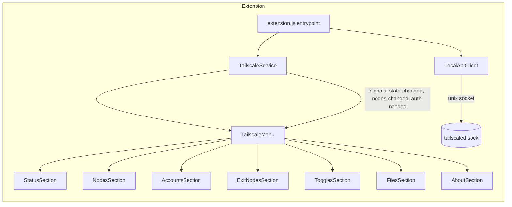
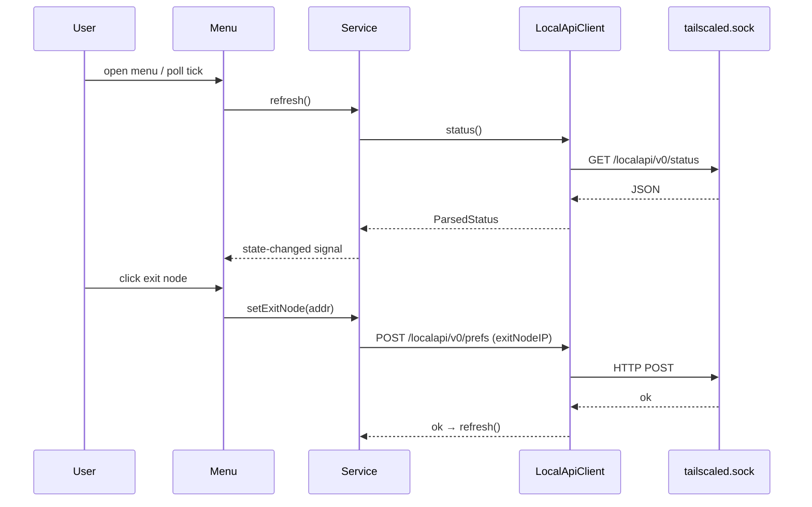

# refactor: LocalAPI-migratie en modernisering van tailscale-status

Dikke upgrade van de GNOME Shell-extensie: van CLI-subprocessen met pkexec-fallback naar de Tailscale LocalAPI over de unix socket, van module-level mutable globals naar GObject-klassen met een schone lifecycle, en van gespawnde hulptools (`zenity`, `xdg-open`) naar in-shell UI. Doel: EGO-conform (gjs.guide review guidelines), robuust op GNOME 45–50, en klaar voor feature-uitbreiding (per-node acties, auto-refresh, suggest-exit-node) zonder de legacy-bouwput.

## Summary

De huidige `extension.js` (817 regels) is één bestand met ~25 module-level globals, roept `tailscale` via `Gio.Subprocess` aan met een stille `pkexec`-retry, monkey-patcht private GNOME-menu-API's (`_setOpenedSubMenu`, `_needsScrollbar`, `_subMenuOpenStateChanged`), en spawnt `zenity` en `xdg-open`. Precies de patronen die de [GNOME Shell review guidelines](https://gjs.guide/extensions/review-guidelines/review-guidelines.html) afkeuren en die op elke GNOME-release kunnen breken. De bovenstroomse TODO ("rewrite to utilize tailscale api") is ook onze koers: de [LocalAPI](https://github.com/tailscale/tailscale/blob/main/ipn/localapi/localapi.go) op `/run/tailscale/tailscaled.sock` levert status, prefs, exit-node-switch en file-routes zonder één privileged subprocess.

**Product Contract preservation**: geen origin document; dit plan bootstrap door alle productgedrag uit de bestaande extensie.

## Problem Frame

- **Wie**: Joep en andere tailnet-beheerders op GNOME 45–50 die het tailnet willen lezen en sturen vanaf het paneel.
- **Pijn**: elke CLI-call is een subprocess (langzaam, stderr-verlies, onzichtbare pkexec-prompt bij first-run), `xdg-open` opent de auth-URL buiten de shell, `zenity` is een extra dependency, en de globals + monkey-patches maken feature-werk risicovol en review-moeilijk.
- **Wat niet**: geen portaal naar andere desktop-omgevingen, geen eigen tray-runtimes, geen pre-gnome45-branch ondersteuning.

## Requirements

- **R1** — Alle tailnet-leesacties (status, accounts/switch --list, nodes, health) lopen via de LocalAPI over de unix socket; geen `Gio.Subprocess` voor reads.
- **R2** — Alle tailnet-schrijfacties (up/down, switch account, exit-node set/clear, accept-routes, shields-up, allow-lan, logout) lopen via LocalAPI (prefs-mutaties via `PATCH /localapi/v0/prefs`, switch via `POST /localapi/v0/profiles/<id>`, start/logout via `POST /localapi/v0/start|logout`); **geen uitzonderingen** — file-acties zijn géén subprocess-uitzondering meer (zie KTD3, geverifieerd). Geen pkexec en geen `--operator`-hacks meer; bij HTTP 403 toont de UI een instructie-item (`tailscale up --operator=<user>`) i.p.v. een auto-pkexec.
- **R3** — Bestandsdelen (Taildrop) is volledig subprocess-vrij: *send* via xdg-desktop-portal FileChooser (DBus, geen Gtk-import in shell-process) + `PUT /localapi/v0/file-put/<stableID>/<name>`; *receive* via `GET /localapi/v0/files/`, `GET /localapi/v0/files/<name>` en `DELETE /localapi/v0/files/<name>`. Zenity verdwijnt.
- **R4** — Auth-flow (`NeedsLogin` + AuthURL) opent niet automatisch op enable, maar toont een knop "Open login page" die via `Gio.AppInfo.launch_default_for_uri_async()` de standaardbrowser opent (URI-launch API, geen subprocess, geen `xdg-open`), plus een "Copy login URL"-actie.
- **R5** — Geen monkey-patching van private menu-API's; nested-submenu scrolling wordt opgelost met een eigen scrollcontainer of door de menubo structure te plat te bouwen.
- **R6** — Alle state (nodes, accounts, backend state) leeft in GObject-klassen; module-level globals verdwijnen; `disable()` verbreekt alle timeouts, signal-connects en subprocesses.
- **R7** — De popup ververst bij open én via een configureerbaar poll-interval (default 60s, instelbaar in prefs, 0 = uit).
- **R8** — GSettings-schema groeit: `login-server` (bestaand), `poll-interval`, `auto-copy-node-address` (bestaand gedrag wordt optioneel), `socket-path` (override voor niet-standaard tailscaled.sock, ook voor Headcale-installaties met afwijkende socket).
- **R9** — `prefs.js` wordt een echte Adw-page met alle R8-instellingen (exclusief St/Clutter-imports in het prefs-proces).
- **R10** — Code is gesplitst in modules onder de extensie-map (`lib/`, `ui/`) met `extension.js` als dunne entrypoint; `prefs.js` eveneens gescheiden.
- **R11** — `metadata.json` blijft shell-version 45–50; wijzigingen moeten per release tegen gjs.guide-conventies checkbaar zijn (lint moet dat afdwingen).
- **R12** — Coverage: een gjs-runnable test-runner (gjs `-m`) test de LocalAPI-client en de node/pref-model-laag tegen een mock-server op een lokale unix socket. UI-laag krijgt smoke-coverage via `make test-wayland` handmatige verificatie.

### Success criteria

1. `grep -rn "pkexec\|zenity\|xdg-open" tailscale-status@maxgallup.github.com/` levert leeg op.
2. Alle functies uit de huidige menu (status, nodes+copy, accounts switch, exit nodes, shield/routes/lan, file send/receive, logout, health, login) werken op GNOME 45–50 zoals vandaag, zonder regressed gedrag.
3. Lint (eslint met gjs-config) en CI draaien groen; zip-artifact per release-tag.

## Scope Boundaries

**In scope**: extension.js, prefs.js, schemas, Makefile, CI-workflow, README-featuregedeelte.

**Niet in scope**: pre-gnome45-branch, KDE/other-DE port, upstream PR terug naar maxgallup (aparte follow-up als de rewrite stabiel is), MSI/exit-node-account booking UI.

### Deferred to Follow-Up Work
- Upstream PR naar maxgallup met de LocalAPI-rewrite.
- SuggestExitNode-endpoint UI (LocalAPI heeft `POST /localapi/v0/suggest-exit-node`); wel alvast in de client-API opgenomen alsmethod maar geen UI-unit.
- netmon/Netcheck-details in het menu.

## Key Technical Decisions

- **KTD1 — LocalAPI via Gio unix-socket client, geen CLI.** `Gio.UnixSocketAddress` + `Gio.SocketClient` naar `/run/tailscale/tailscaled.sock`; JSON endpoints: `GET /localapi/v0/status`, `GET /localapi/v0/prefs`, `POST /localapi/v0/prefs` (update), file-routes via `/localapi/v0/file/*`. Rationale: LocalAPI is de SSOT die de CLI zelf onder water ook gebruikt; kills pkexec (R1/R2) en geeft betere foutmodi. Alternative rejected: CLI behouden met alleen auth-fixes — houdt pkexec en alle betrouwbaarheidsproblemen overeind.
- **KTD2 — `tailscale switch --list` wordt MultiAccount via `/localapi/v0/profiles`.** Profiles-endpoint geeft accountlijst + current id gestructureerd; geen email-regex scraping meer (huidige code matcht emails met een regex).
- **KTD3 — Bestandsdelen volledig subprocess-vrij: xdg-desktop-portal FileChooser (DBus) + LocalAPI `file-put`/`files`.** Eerdere planversie hield `tailscale file cp` als fallback-uitzondering open (session-settled: user-directed — file-send de enige denkbare uitzondering op R2). Endpoint-verificatie (zie LocalAPI Endpoint Verification) toonde `GET /localapi/v0/file-targets` + `PUT /localapi/v0/file-put/<stableID>/<name>`, waardoor de uitzondering **vervalt**: geen shell-tool, geen pkexec, geen whitelist-escape. Bestands-*selectie* loopt via `org.freedesktop.portal.FileChooser` over DBus (systeemstandaard in GNOME, geen Gtk-introspection in shell-process nodig).
- **KTD4 — UI-herstructurering naar eigen GObject-klassen per menudeel (`StatusItem`, `NodesSection`, `AccountsSection`, `ExitNodesSection`, `FilesSection`, `TogglesSection`, `AboutSection`), elk met eigen signalen en cleanup.** Rationale: R5/R6; review guidelines vragen clean resource-ownership.
- **KTD5 — Gjs lint: `eslint` + `@gjs/`-config (of shell-recommended preset) in CI via GitHub Actions op self-hosted runner (chef-platform-aws-01), met `zip`-artifact build.** Rationale: EGO-review vraagt versie-onafhankelijke conventies; CI zorgt dat forks niet drift.
- **KTD6 — Poll-loop: één GLib timeout in de extension, gereset bij `disable()`.** Rationale: één actor, geen interval-leaks.
- **KTD7 — GJS-runtimetests zijn merge-blocking in CI.** Geen "lint-only als gjs ontbreekt"-escape hatch: de workflow installeert `gjs` op de runner en draait de unit-suite altijd; een failing of skippende test-run blokkeert de merge. (session-settled: user-directed — gegeven door Joep in review; alternatief "waar beschikbaar" was een groen-PR-zonder-runtime-tests risico.)
- **KTD8 — Expliciete service-ownership, geen singleton.** `extension.js` maakt in `enable()` één `TailscaleService`-instance, injecteert die in de menu-secties, en vernietigt hem in `disable()`. Geen module-level state tussen extension-reloads. (session-settled: user-directed — alternatief "singleton" verbergde state over reloads.)

## High-Level Technical Design

- **LocalApiClient**: enige plek die de socket kent; aanbiedt `status()`, `prefs()`, `setPrefs()`, `profiles()`, `switchProfile()`, `suggestExitNode()`, file-list/send/get. Async via `Gio.SocketClient` + `Gio.DataInputStream`; fouts gaan als genormaliseerde `LocalApiError` omhoog (geen stille `myError`-catch-and-continue).
- **TailscaleService**: cache + derive (`extractNodeInfo`-logica, sortering, tree-build als pure functies in `lib/nodes.js`), singleton, `enable()`/`disable()`, één poll-timer + signal-emitters.
- **TailscaleMenu**: bouwt de 7 secties; geen monkey-patches; submenu-scroll wordt opgelost met een eigen `St.ScrollView` op root of door twee-niveau diepte max in Mullvad-tree (Flat submenu per city).

## Implementation Units

### U1. LocalApiClient + mock-server testbasis
**Goal:** `/localapi/v0`-client over unix socket met genormaliseerde fouten en een gjs-runnable test against a mock socket server.
**Requirements:** R1, R2, R8, R12
**Dependencies:** geen
**Files:** `tailscale-status@maxgallup.github.com/lib/localapi.js`, `tests/lib/localapi.test.js`, `tests/mock/localapi-server.js`, `tests/run.js`
**Approach:**
1. `lib/localapi.js`: `LocalApiClient`-klasse met `socketPath`-injection (uit GSettings `socket-path`, default `/run/tailscale/tailscaled.sock`); de client bezit géén globale state — instanties worden expliciet aangemaakt door de eigenaar (KTD8).
2. Endpoints (alle geverifieerd tegen live tailscaled 1.102.3 + upstream source, zie LocalAPI Endpoint Verification): `status`, `prefs` (GET + PATCH-merge), `profiles/` (GET-list, GET-current, POST-`<id>`-switch, DELETE), `files/` (GET-list, GET-`<name>`-download, DELETE-`<name>`), `file-targets`, `file-put`, `suggest-exit-node`, `start`, `logout`.
3. Alle calls async; retourneren parsed JSON of werpen `LocalApiError {code, message}`; geen stdout/stderr-string parsing. HTTP over unix socket via `Gio.SocketClient` + handmatige HTTP/1.1 met `Connection: close` (leest body tot EOF, immune voor chunked-vs-length).
4. Mock-server: gjs `Gio.SocketService` op temp unix socket die canned JSON responses serveert (fixtures in `tests/fixtures/`).
**Patterns to follow:** bestaande `Gio.Subprocess`-asyncpatronen vervangen door `Gio.SocketClient` async API's (communicate_utf8_async-achtige keten).
**Test scenarios:**
- Happy path: status() op mock levert parsed object met Self/Peer/Health.
- Socket niet aanwezig → `LocalApiError` met duidelijke code, geen crash.
- HTTP 500 van mock → `LocalApiError` met server-foutmelding doorgegeven.
- switchProfile() POST't correct body en handt success/failure goed af.
- Timeout (mock die niet reageert) → reject binnen redelijke tijd.
**Verification:** `gjs -m tests/run.js` draait groen; geen enkele referentie naar subprocess in dit bestand.

### U2. Node/prefs-model en pure functies
**Goal:** `TailscaleNode`, sortering, group-tree, `getUsername`, `extractNodeInfo` als pure functies in `lib/nodes.js` (geen menu-side effects).
**Requirements:** R1, R6, R10, R12
**Dependencies:** U1
**Files:** `tailscale-status@maxgallup.github.com/lib/nodes.js`, `tests/lib/nodes.test.js`
**Approach:** bestaande logica uit `extension.js` (extractNodeInfo, sortProp/combineSort/sortArrProp, getUsername, groupPath/Mullvad) verhuizen en teruggeven als data (nodes array + tree), zonder menu-mutatie.
**Test scenarios:**
- Self-node eerst, dan online peers, dan offline; Mullvad-tree klopt per Country/City.
- Node zonder `TailscaleIPs` wordt geskipt.
- Peer met tag:mullvad-exit-node maar zonder Location landt op `["Mullvad"]`.
- getUsername resolved LoginName uit User-map op UserID; fallback HostName.
**Verification:** unit tests groen; functies zijn pure functies zonder side effects.

### U3. TailscaleService met lifecycle en poll
**Goal:** één service-object dat refresh, state-cache, poll-timer en signals bezit; expliciet geowned door `extension.js` (KTD8), niet singleton.
**Requirements:** R6, R7
**Dependencies:** U1, U2
**Files:** `tailscale-status@maxgallup.github.com/lib/service.js`
**Approach:** GObject-klasse met signalen `state-changed(status)`, `nodes-changed(nodes, tree)`, `auth-needed(authUrl)`; `refresh()` trigert status() async en emit; poll-interval uit GSettings; timer-id opgeslagen en in `disable()` verwijderd; schrijfacties (setPrefs, switch, file) direct via client en zelf refresh triggerend. `extension.js` maakt de instance in `enable()`, injecteert hem in `TailscaleMenu`, en roept `service.destroy()` in `disable()` — geen enkele module bewaart een globale reference.
**Test scenarios:**
- refresh() met mock-status emit `state-changed` één keer met juiste state.
- Poll-timer stopt volledig na `disable()` (geen verdere emits).
- Netwerkfout bij refresh: signal met error-state, geen onafgehandelde rejection, geen crash.
**Verification:** unit tests tegen mock; geen global variabelen meer (eslint `no-undef`/module-scope check).

### U4. Menu-herstructurering per sectie
**Goal:** popupmenu herbouwd uit 7 GObject-secties; geen monkey-patches; identieke feature-pariteit.
**Requirements:** R4, R5, R6
**Dependencies:** U3
**Files:** `tailscale-status@maxgallup.github.com/ui/section-*.js` (status, nodes, accounts, exit-nodes, toggles, files, about), `tailscale-status@maxgallup.github.com/ui/menu.js`
**Approach:**
1. Elke sectie een `GObject.registerClass`-MenuItem met eigen signalen en destroy-cleanup.
2. `FixedSubMenuMenuItem`-monkeypatch vervangen: submenu-scroll wordt opgelost door root-scroll container die het scrollen zelf afvangt (R5); copy-paste van PopupSubMenu.open()-hoogte-handling verdwijnt.
3. Status-auth: "Open login page"-knop die via `Gio.AppInfo.launch_default_for_uri_async()` de login-URL opent — de standaard GIO URI-launch API, geen subprocess, geen `xdg-open` (R4); "Copy login URL" als secundaire actie. Geen auto-open op enable.
4. Account-switch via profiles (`GET /localapi/v0/profiles/` + `POST /localapi/v0/profiles/<id>`, KTD2) — geen email-regex scraping.
5. Mullvad-tree: maximaal 2 niveaus (land → steden-lijst) om nesting-bug te omzeilen.
**Patterns to follow:** GNOME shell `PopupMenu.PopupSwitchMenuItem`/`PopupSubMenuMenuItem` standaardgebruik; geen private-API touches.
**Test scenarios:**
- Pariteit: elke oude menufunctie (status, copy node address, switch account, exit node set/clear, shield/routes/lan toggles, send/receive files, logout, health, login) heeft een zichtbaar menu-item dat dezelfde service-call triggert.
- No-op click op reactieve statusitems mag geen service-call doen.
- Secties destroyen netjes: geen signalen overgebleven na destroy (verifieer via service.disconnect-count in test of handmatige review).
**Verification:** `make test-wayland` smoke op GNOME 49/50: alle menu-onderdelen tonen, geen console-fouten in journalctl.

### U5. Bestandsdelen zonder subprocess
**Goal:** Send-files via xdg-desktop-portal FileChooser (DBus) + LocalAPI `file-put`; receive-files via LocalAPI files-endpoints; zenity, pkexec en de CLI-fallback verdwijnen volledig (KTD3).
**Requirements:** R2, R3
**Dependencies:** U1, U4
**Files:** `tailscale-status@maxgallup.github.com/ui/section-files.js`, `tailscale-status@maxgallup.github.com/lib/localapi.js`, `tailscale-status@maxgallup.github.com/lib/portal.js`
**Approach:**
1. `lib/portal.js`: dunne DBus-wrapper rond `org.freedesktop.portal.FileChooser.OpenFile` (returns file-URIs) via `Gio.DBusProxy` — systeemstandaard file-picker, geen Gtk-import in shell-process.
2. Send: portal-pick → `Gio.File.load_contents` → `GET /localapi/v0/file-targets` (target-kiezer uit online peers) → `PUT /localapi/v0/file-put/<stableID>/<name>`.
3. Receive: `GET /localapi/v0/files/?waitsec=0` (lijst) → `GET /localapi/v0/files/<name>` (download, binary-safe) → opslaan in Downloads → `DELETE /localapi/v0/files/<name>`.
**Test scenarios:**
- Receive-files met mock LocalAPI downloadt naar tempdir, DELETE't daarna, notify't.
- Send-files: file-put PUT't body met juiste Content-Length en escaped name; fout (403/500) komt als `LocalApiError` in de UI.
- Portal afwezig (headless/mock) → nette foutmelding, geen crash, geen subprocess-fallback.
- Binary-payload (bytes met nullen) blijft byte-exact door de client-laag.
**Verification:** geen zenity/pkexec/`tailscale file`-referentie meer (grep-check in CI); unit-tests binary-exact.

### U6. GSettings, prefs.js en schema-uitbreiding
**Goal:** schema met `login-server`, `poll-interval`, `auto-copy-node-address`, `socket-path`; Adw-prefs page met alle velden.
**Requirements:** R7, R8, R9
**Dependencies:** U3, U4
**Files:** `tailscale-status@maxgallup.github.com/schemas/org.gnome.shell.extensions.tailscale-status.gschema.xml`, `tailscale-status@maxgallup.github.com/prefs.js`
**Approach:** poll-interval als uint default 60; socket-path als string default `/run/tailscale/tailscaled.sock` (voor Headcale-/custom installs); prefs.js alleen Adw/Gtk imports (gjs guideline: geen St/Clutter in prefs).
**Test scenarios:**
- Schema compileert (`glib-compile-schemas`) en defaults worden geladen.
- Wijziging poll-interval herstart de service-poll zonder her-enable.
- Prefs-venster toont alle velden en persisteert wijzigingen.
**Verification:** schema-validatie in CI; handmatige smoke.

### U7. Build, lint, CI en packaging
**Goal:** eslint (gjs-conventies) + zip-artifact in GitHub Actions; release-process vastlegd.
**Requirements:** R10, R11
**Dependencies:** U1–U6
**Files:** `.github/workflows/ci.yml`, `.eslintrc.json` (of `eslint.config.mjs`), `package.json` (dev-only), `Makefile`-aanvulling, `README.md` (dev/CI-sectie)
**Approach:**
1. eslint met gjs-extensies (`no-unused-vars`, `no-undef` op GJS-globals, `no-redeclare`); CI draait **altijd** lint + tests — `gjs` wordt op de runner geïnstalleerd (apt), de unit-suite is **merge-blocking** (KTD7): geen skip, geen lint-only-fallback.
2. CI: GitHub Actions op self-hosted runner (chef-platform-aws-01), zip-artifact bij tag, artifact-name `tailscale-status@maxgallup.github.com-<version>.zip`.
3. Makefile: `make lint`, `make test`, `make zip`.
4. Extra CI-guard: grep-fail wanneer `pkexec`, `zenity` of `xdg-open` voorkomt in de extensie-map.
**Test scenarios:**
- CI draait op push en PR; failing lint blokkeert merge.
- Zip-artifact bevat de extensie-map met metadata/schemas/compiled schema binary.
**Verification:** groene CI op deze branch; zip-artifact downloadbaar.

### U8. docs en release-check
**Goal:** README-feature-lijst bijwerken (auto-open login verwijderd → knop, poll-interval, socket-path), docs/notes.md up-to-date, metadata version bump.
**Requirements:** R4, R7, R8
**Dependencies:** U1–U7
**Files:** `README.md`, `docs/notes.md`, `tailscale-status@maxgallup.github.com/metadata.json`
**Approach:** feature-lijst herschrijven naar de nieuwe flows; toevoegen van bekende beperking (self-hosted socket-path override); version bump in metadata.json volgens upstream-nummering.
**Test expectation: none** — documentatie-only.
**Verification:** README leest consistent met de nieuwe UI; version-bump zichtbaar in metadata.

## Verification Contract

- **Unit (merge-blocking)**: `gjs -m tests/run.js` — U1, U2, U3, U5 mock-tests groen; vereiste check in CI (KTD7), draait op elke push en PR.
- **Lint + guards**: `make lint` groen; CI grep-check: zero referenties naar `pkexec`/`zenity`/`xdg-open` in de extensie-map.
- **Endpoint-evidence**: alle gemaakte LocalAPI-calls staan in de geverifieerde endpoint-tabel (zie LocalAPI Endpoint Verification); afwijkingen zijn een review-blokkeerder.
- **Smoke**: `make test-wayland` op GNOME 49/50: extensie laadt, menu opent, status klopt, exit-node switch werkt, geen journalctl-fouten.
- **Release**: CI-artifact zip installeerbaar via Extension Manager (handmatige check per release).
- **Exact-head**: bovenstaande checks worden bewezen op de uiteindelijke commit-SHA (CI-log + testoutput), niet op een eerdere tussenstand.

## Definition of Done

- Alle requirements R1–R12 af; success criteria 1–3 bewezen met de Verification Contract-artefacten (CI-log, smoke-screenshot/journalctl-output, zip-artifact).
- `disable()` bevestigd leak-vrij (meerdere enable/disable-cycli zonder mem-groei of dubbele timers).
- Geen regressies in feature-pariteit; de bovenstroomse TODO is daarmee aangevinkt en kan naar maxgallup als PR (deferred follow-up).

## Open Questions

- **Q1 (resolved 2026-09-01)**: File-dialog in shell-process — opgelost zonder Gtk: xdg-desktop-portal FileChooser over DBus (KTD3); de `tailscale file cp`-fallback-uitzondering is vervallen omdat `file-targets`/`file-put` geverifieerd zijn.
- **Q2 (resolved 2026-09-01)**: Socket-paadvariantie — live daemon en upstream gebruiken `/run/tailscale/tailscaled.sock`; de `socket-path`-GSettings override dekt afwijkende installs (Headcale-hosts, user-mode tailscaled).

## LocalAPI Endpoint Verification (2026-09-01)

Geverifieerd tegen (a) live tailscaled op deze laptop (tailscale **1.102.3**, GNOME Shell 50.1, gjs 1.88) met read-only GET/POST-suggest probes, en (b) upstream source (`ipn/localapi/localapi.go` + `client/local/local.go` op `main`). Alle door het plan gebruikte endpoints zijn hiermee bewezen; de client-laag implementeert exact deze tabel.

| Functie | Methode + endpoint | Live | Upstream-opmerking |
|---|---|---|---|
| Status/nodes/health | `GET /localapi/v0/status` | 200 | exact-match handler `status` |
| Prefs lezen | `GET /localapi/v0/prefs` | 200 | Prefs JSON incl. ShieldsUp, RouteAll, ExitNodeIP, ExitNodeAllowLANAccess, WantRunning |
| Prefs muteren (up/down, toggles, exit-node) | `PATCH /localapi/v0/prefs` | (schrijftest door implementatie) | client gebruikt PATCH met merge-body |
| Start ("up") | `POST /localapi/v0/start` | — | 204; alternatief WantRunning via PATCH prefs |
| Logout | `POST /localapi/v0/logout` | — | 204 |
| Accounts lijst | `GET /localapi/v0/profiles/` | 200 (**trailing slash verplicht**) | prefix-match handler `profiles/` |
| Huidig profiel | `GET /localapi/v0/profiles/current` | 200 | `ipn.LoginProfile` |
| Account wisselen | `POST /localapi/v0/profiles/<id>` | — | 204, `<id>` = profile Key; profiles vereist `PermitWrite` |
| Wachtende bestanden | `GET /localapi/v0/files/?waitsec=0` | 200 (`null` = leeg) | trailing slash + query; array van `apitype.WaitingFile` |
| Bestand downloaden | `GET /localapi/v0/files/<name>` | — | name URL-escaped; binary stream |
| Bestand verwijderen | `DELETE /localapi/v0/files/<name>` | — | 204 |
| File-targets (Taildrop-ontvangers) | `GET /localapi/v0/file-targets` | 200 | lijst met `StableID` per peer |
| Bestand sturen | `PUT /localapi/v0/file-put/<stableID>/<name>` | — | binary body, escaped name |
| Exit-node-suggestie | `POST /localapi/v0/suggest-exit-node` | 200 | deferred UI, client-methode al aanwezig |

Verificatie-gotchas die de implementatie volgt: `profiles` en `files` zijn **prefix-match routes** — zonder trailing slash treedt 404 op; `switch --list`-equivalent is profiles-list met `Name` (login email) i.p.v. regex-scraping; non-root toegang vraagt operator-grant (`tailscale up --operator=<user>`) — UI toont instructie-item bij HTTP 403 in plaats van pkexec. Evidence: `.compound-engineering/artifacts/evidence/localapi-endpoint-verification-2026-09-01.md`.

## Risks & Dependencies

- **R-adv LocalAPI-stabiliteit**: LocalAPI is intern API, endpoints kunnen per Tailscale-release wijzigen. Mitigatie: client-laag geïsoleerd (U1), error-afhandeling toont duidelijke `LocalApiError`-state in plaats van stille crash.
- **R-adv GNOME-review**: `Gtk`-import in shell-process en file-dialog beschikbaarheid zijn review-punt. Mitigatie: gjs.guide-conventies in lint/CI (U7), fallback in U5.
- **R-adv Feature-pariteit**: opbouwen van menu opnieuw kan klein gedrag verliezen (bijv. `needs login` auto-open). Mitigatie: U4-pariteitslijst + smoke-run.
- **Dependency**: Tailscale ≥ versie met `profiles`-endpoint (reed lang beschikbaar); documenteer minimum-versie in README.

## Alternatives Considered

- **CLI behouden, alleen auth fix** — snel, maar laat pkexec, subprocess-latency en parse-fragility overeind; rejected.
- **Direct HTTP naar controlplane (REST) i.p.v. LocalAPI** — extra auth-token nodig en omzeilt tailscaled; rejected.
- **Geleidelijke per-unit migratie zonder restructure** — kleinere diffs maar houdt globals en monkey-patches in leven; rejected tegenover U1–U4-volgorde.

## Sources & Research

- [Tailscale LocalAPI source (`localapi.go`)](https://github.com/tailscale/tailscale/blob/main/ipn/localapi/localapi.go) — endpoints, unix socket `/var/run/tailscale/tailscaled.sock` (load-bearing voor KTD1).
- [GNOME Shell Extensions Review Guidelines](https://gjs.guide/extensions/review-guidelines/review-guidelines.html) — pkexec-aversie, GObject/imports-conventies (load-bearing voor KTD3/U4/U7).
- [GNOME 50 review backlog](https://discourse.gnome.org/t/gnome-50-extension-review-status/34569) — shell-version 50-inclusie vraagt strikte conventies (informs U7/R11).
- Bovenstroomse TODO in README.md: "Rewrite extension to utilize tailscale api instead of running tailscale commands" (origin-anchoring voor KTD1).
